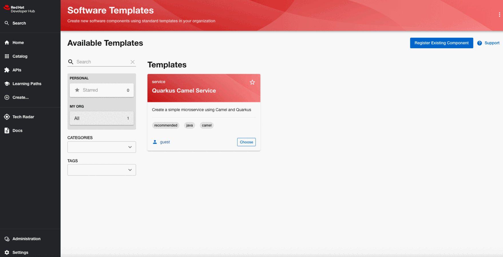

# RedHat Developer Hub demo

The purpose of the repository is to show the integration between Red Hat Developer Hub (aka Backstage) and other Red Hat products as Red Hat OpenShift Pipelines and Red Hat OpenShift GitOps.

Structure of the repository:
- [CI/CD configurations](manifest/cicd)
- [Backstage configurations](manifest/backstage)
- [Golden path software templates](template/apps)
- [Golden path documentation templates](template/docs/)

# Local environment
The local environment is based on OpenShift Local (aka CodeReady Containers) configured as follows:
```
crc config view
- consent-telemetry                     : no
- cpus                                  : 6
- disk-size                             : 150
- memory                                : 20000
- pull-secret-file                      : $HOME/Workspace/CRC/pull-secret.json
```

Run local env:
```
crc setup
crc start
```

# Setup

## Pre-requisite

Installing the following operators using the OpenShift CLI:
- Red Hat OpenShift Pipelines (aka Tekton)
- Red Hat OpenShift GitOps (aka ArgoCD)

```
oc create ns openshift-gitops-operator
oc apply -f manifest/cicd/sub.yaml
```

### CI/CD

Create namespace:
```
oc create ns rhdh-demo
```

Create `Secret` to store image registry credentials:
```
oc create secret generic pipeline-quay-secret -n rhdh-demo \
  --from-literal=username=<your_quay_username> \
  --from-literal=password=<your_quay_token> \
  --type=kubernetes.io/basic-auth

oc annotate secret/pipeline-quay-secret -n rhdh-demo \
    'tekton.dev/docker-0=https://quay.io'
```

Create `ServiceAccount` and `ClusterRoleBinding` in order to grant permissions on ServiceAccount:
```
oc apply -f manifest/cicd/sa.yaml -n rhdh-demo
oc apply -f manifest/cicd/cluster-role-binding.yaml
```

Create `PersistentVolumeClaim` for persistent volume:
```
oc apply -f manifest/cicd/pvc.yaml -n rhdh-demo
```

Create a simple `ArgoCD` instance:
```
oc apply -f manifest/cicd/argocd.yaml
# expose insecure route, because the backstage argocd plugin doesn't support self-signed certificates
oc apply -f manifest/cicd/route.yaml
```

Create a simple Tekton `Pipeline`:
```
oc apply -f manifest/cicd/pipeline.yaml -n rhdh-demo
```

### Backstage

Create `ConfigMap` for adding custom application configurations:
```
oc apply -f manifest/backstage/cm.yaml -n rhdh-demo
```

Create `Secret` for env variables:
```
ARGOCD_PASSWORD=$(oc get secret/openshift-gitops-cluster -n openshift-gitops -o jsonpath='{.data.admin\.password}' | base64 -d)

oc create secret generic rhdh-secret -n rhdh-demo \
    --from-literal=GITHUB_APP_CLIENT_ID=<your_github_client_id> \
    --from-literal=GITHUB_APP_CLIENT_SECRET=<your_github_secret> \
    --from-literal=GITHUB_TOKEN=<your_github_token> \
    --from-literal=K8S_CLUSTER_NAME=crc \
    --from-literal=K8S_CLUSTER_URL="https://api.crc.testing:6443" \
    --from-literal=ARGOCD_USERNAME=admin \
    --from-literal=ARGOCD_PASSWORD=$ARGOCD_PASSWORD
```

Create `ServiceAccount`, `ClusterRole` and `ClusterRoleBinding` in order to grant permissions on ServiceAccount:
```
oc apply -f manifest/backstage/sa.yaml -n rhdh-demo
oc apply -f manifest/backstage/cluster-role.yaml -n rhdh-demo
oc apply -f manifest/backstage/cluster-role-binding.yaml
```

Create `Secret` for k8s access token:
```
oc apply -f manifest/backstage/secret.yaml -n rhdh-demo
```

## Install the Chart

Add the chart repository using the following command:
```
helm repo add openshift-helm-charts https://charts.openshift.io/
```

Install the chart:
```
helm upgrade -i rhdh-demo -n rhdh-demo -f values.yaml openshift-helm-charts/redhat-developer-hub
```

Check plugins installation:
```
oc logs -l app.kubernetes.io/component-backstage -c install-dynamic-plugins
```

Check backstage service:
```
oc logs -l app.kubernetes.io/component-backstage -c backstage
```

## Test

### Create new component



### Build component

Run the pipeline from the tekton cli:
```
tkn pipeline start quarkus-pipeline -s pipeline-sa-secret -n rhdh-demo \
    --param gitUrl=https://github.com/<your_github_account>/quarkus-camel-demo.git \
    --param gitRevision=master \
    --param contextDir=. \
    --param imageGroup=<your_quay_account> \
    --param imageName=quarkus-camel-demo \
    --param baseImage=registry.access.redhat.com/ubi8/openjdk-11 \
    --workspace name=shared-workspace,claimName=shared-workspace \
    --workspace name=maven-settings,claimName=maven-settings
```

### Deploy component

Login with ArgoCD cli:
```
ARGOCD_PASSWORD=$(oc get secret/openshift-gitops-cluster -n openshift-gitops -o jsonpath='{.data.admin\.password}' | base64 -d)
ARGOCD_URL=$(oc get route openshift-gitops-server -n openshift-gitops -o jsonpath='{.spec.host}{"\n"}')

argocd login --insecure --grpc-web $ARGOCD_URL:80 --username admin --password $ARGOCD_PASSWORD
``` 

Add new repository:
``` 
argocd repo add https://github.com/<your_github_account>/quarkus-camel-demo.git \
    --username <your_github_username> \
    --password <your_github_token>
``` 

Create new appplication:
``` 
argocd app create quarkus-camel-demo \
    --repo https://github.com/<your_github_account>/quarkus-camel-demo.git \
    --path manifest \
    --revision master \
    --dest-server https://kubernetes.default.svc \
    --dest-namespace rhdh-demo
```

Sync application:
```
argocd app sync quarkus-camel-demo
```

## Uninstalling the Chart
```
helm uninstall -n rhdh-demo rhdh-demo
```

## Custom dynamic plugin wrapper

### Test on local Janus
```
LOCAL_DYNAMIC_PLUGIN_ROOT_DIR=<your_janus_path>/dynamic-plugins-root

cd dynamic-plugins/wrappers/roadiehq-backstage-plugin-http-request-dynamic

yarn install && yarn tsc
yarn export-dynamic --dev --dynamic-plugins-root $LOCAL_DYNAMIC_PLUGIN_ROOT_DIR
```

### Test the dynamic plugin on OCP
Build:
```
DYNAMIC_PLUGIN_ROOT_DIR=/tmp/dynamic-plugins-root
mkdir $DYNAMIC_PLUGIN_ROOT_DIR

cd dynamic-plugins/wrappers/roadiehq-backstage-plugin-http-request-dynamic

yarn install && yarn tsc && yarn export-dynamic

INTEGRITY_HASH=$(npm pack ./dist-dynamic --pack-destination $DYNAMIC_PLUGIN_ROOT_DIR --json | jq -r '.[0].integrity')  \
  && echo "Plugin integrity Hash: $INTEGRITY_HASH"

ls -l $DYNAMIC_PLUGIN_ROOT_DIR
```

Build simple plugin registry:
```
oc project rhdh-demo
oc new-build httpd --name=plugin-registry --binary                         
oc start-build plugin-registry --from-dir=$DYNAMIC_PLUGIN_ROOT_DIR --wait   
oc new-app --image-stream=plugin-registry                                  
```

For any plugin updates:
```
oc start-build plugin-registry --from-dir=$DYNAMIC_PLUGIN_ROOT_DIR --wait
```

## Documentation

- [RedHat Pipelines](https://docs.openshift.com/pipelines/1.14/install_config/installing-pipelines.html#op-installing-pipelines-operator-using-the-cli_installing-pipelines)
- [RedHat GitOps](https://docs.openshift.com/gitops/1.12/installing_gitops/installing-openshift-gitops.html#installing-gitops-operator-using-cli_installing-openshift-gitops)
- [RedHat Developer Hub Overview](https://developers.redhat.com/rhdh/overview)
- [RedHat Developer Hub Product](https://access.redhat.com/documentation/en-us/red_hat_developer_hub/1.1)
- [RedHat Developer Hub Plugins](https://access.redhat.com/documentation/it-it/red_hat_plug-ins_for_backstage/2.0)
- [Dynamic Plugins support](https://github.com/janus-idp/backstage-showcase/blob/main/showcase-docs/dynamic-plugins.md)
- [Dynamic Plugins(unofficial documentation)](https://github.com/sgahlot/rhdh-op-config/tree/main/dynamic-plugins)